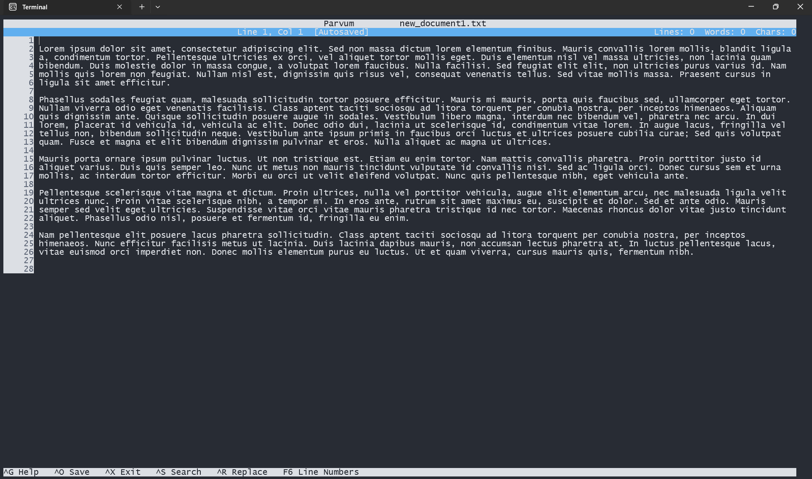
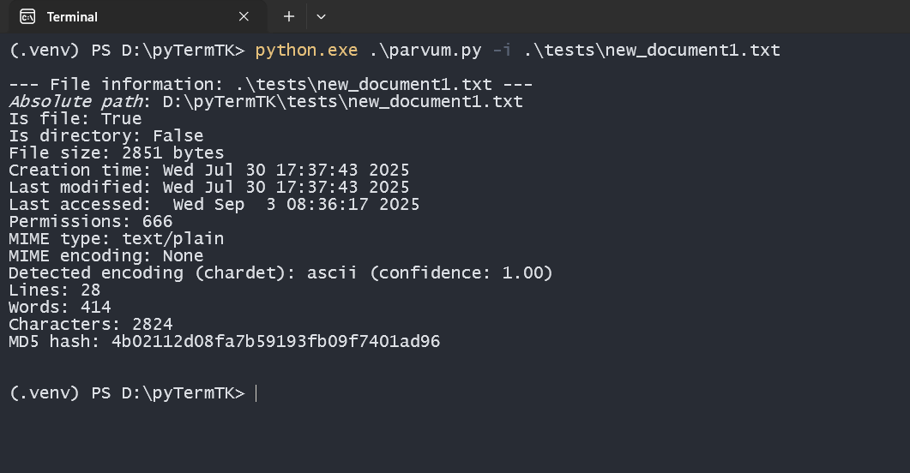

# Codix Editor - Lightweight Console Text Editor for Windows

**Codix** is a nano-inspired terminal-based text editor specifically designed for Windows environments. Built with Python and Urwid, it combines the simplicity of classic Unix editors with modern Windows-friendly features.

## Key Features ✨
- 🖥️ **Windows-native** - No WSL/Cygwin required
- 📝 **Intuitive UI** with cursor position tracking
- 🔒 **Safe editing** with path validation and backup system
- ⏱️ **Auto-save** (configurable interval)
- 🔍 **Advanced search/replace** with caching
- 📊 **Real-time document stats** (lines, words, characters)
- 🔢 **Toggleable line numbers** with large-file optimization
- ⏪ **History system** with smart memory management
- 🛡️ **File size protection** prevents loading huge files

## Installation & Usage
```bash
python codix.py [filename]
```
## Hotkeys

| Shortcut   | Action              |
|------------|---------------------|
| `Ctrl + O` | Safe file           |
| `Ctrl + X` | Exit editor         |
| `Ctrl + S` | Search              |
| `Ctrl + R` | Replace             |
| `F3`       | Next search result  |
| `F6`       | Toggle line numbers |
| `Ctrl + Z` | Undo                |
| `Ctrl + Y` | Redo                |
| `Ctrl + G` | Help                |

## Screenshots




## Video

[video.mp4](resources/video.mp4)
